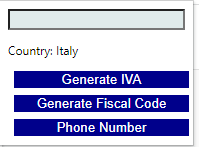

# Pisa
A chrome extension that generates Italian utilities

- Fiscal Code
- IVA
- Phone Number

# How to use
1. [Download](https://github.com/hd1fernando/Pisa/tags) de latest tag.
2. Unzip.
3. Enable develop mode on Chrome.
4. Load the unzipped folder.

# References:
- https://www-icosaedro-it.translate.goog/cf-pi/?_x_tr_sch=http&_x_tr_sl=it&_x_tr_tl=pt&_x_tr_hl=en&_x_tr_pto=wapp
